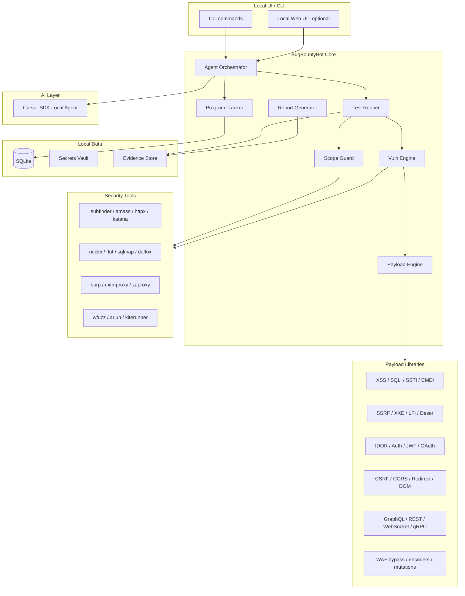

# BugBounty Bot Pro — Personal Bug Bounty Agent Plan

A **local, single-user agent** that tracks bug bounty programs, runs **comprehensive scoped security tests** with a built-in payload engine, and generates submission-ready reports — for personal use only.

> **Authorization required:** All testing, payloads, and scans run only against targets explicitly listed in program scope. Out-of-scope and destructive payloads are blocked by Scope Guard.

---

## 1. Goals and Constraints

| Goal | What it means |
|------|----------------|
| **Track** | Programs, scope, submissions, payouts, deadlines |
| **Test** | Full-spectrum vuln testing on **in-scope, authorized** targets |
| **Payload** | Built-in payload libraries for every major bug class + WAF bypass variants |
| **Report** | Evidence-backed drafts ready for HackerOne/Bugcrowd/etc. |
| **Personal** | Local-first, single-user, no shared cloud by default |

**Hard rules (non-negotiable):**

- Only test targets explicitly in program scope
- Respect rate limits, platform rules, and program-specific restrictions (e.g. no DoS, no social engineering)
- Store secrets locally (Keychain / env), never in git
- Agent suggests and runs tools — you approve **Tier 3+** (active exploit) actions
- Payloads tagged by risk tier; destructive payloads disabled by default
- Never auto-submit reports — human review required

**Corrections applied in this revision:**

| Issue in v1 | Fix |
|-------------|-----|
| Test Runner only covered recon + nuclei | Added **Vuln Engine** with per-class test modules |
| No payload system | Added **Payload Engine** with categorized libraries |
| MVP too narrow for vuln coverage | Split MVP into tracker MVP + phased vuln modules |
| Missing API/GraphQL/mobile/auth testing | Added full vulnerability taxonomy (Section 8) |
| No WAF/bypass strategy | Added encoder chains + bypass payload sets |
| Tool list incomplete | Expanded external tools per vuln class |
| No detection logic | Added match signals / confirmation rules per module |

---

## 2. High-Level Architecture



**Design principle:** SQLite + local files = source of truth. Payload Engine supplies test inputs; Vuln Engine orchestrates injection points, encoders, and confirmation; AI summarizes and drafts reports.

---

## 3. Core Modules

### Module A — Program & Bounty Tracker

*(unchanged core — expanded scope parser)*

**Features:**

- Add programs manually or import from HackerOne/Bugcrowd (API or CSV)
- Scope parser: domains, IPs, CIDR, wildcards, mobile apps, API bases, out-of-scope rules
- **Vuln policy per program:** allowed test tiers, blocked categories (e.g. no brute-force on login)
- Submission lifecycle: `draft → submitted → triaged → accepted/rejected → paid`
- Payout and time tracking
- Reminders: scope changes, expiring programs, follow-ups

**Data entities:**

```
Program → ScopeRules → Targets
Program → VulnPolicy → AllowedTiers / BlockedModules
Program → Submissions → Findings → Evidence → PayloadUsed
Program → Notes / Tags
```

---

### Module B — Scoped Test Runner

**Pipeline stages:**

| Stage | Tools | Output |
|-------|-------|--------|
| **Recon** | subfinder, amass, httpx, katana, dnsx | Subdomains, live hosts, tech stack, TLS info |
| **Discovery** | ffuf, gau, waybackurls, arjun, kiterunner | Endpoints, params, JS files, API routes |
| **Fingerprint** | wappalyzer, nuclei (tech), whatweb | Framework, CMS, server, WAF detection |
| **Passive scan** | nuclei (passive templates), trufflehog | Misconfigs, secrets in JS, headers |
| **Active vuln scan** | Vuln Engine + Payload Engine | Candidate findings per class |
| **Confirmation** | Module-specific validators | Verified vs suspected findings |
| **Manual assist** | Agent suggests next tests + payloads | Test plan per target |

**Scope Guard (critical):**

- Every request validated against `ScopeRules` before execution
- Block out-of-scope domains, IPs, third-party assets, CDN edges not in scope
- Block Tier 4 payloads (data destruction, DoS, mass enumeration) unless explicitly enabled
- Log every request: URL, payload hash, tier, timestamp, scope snapshot

**Risk tiers:**

| Tier | Examples | Default |
|------|----------|---------|
| **T1 — Passive** | Header checks, robots.txt, sitemap, passive nuclei | Auto |
| **T2 — Safe active** | Reflected XSS probes, open redirect, CORS, IDOR read | Auto with rate limit |
| **T3 — Exploit confirm** | SQLi confirm, SSRF callback, SSTI, stored XSS | Requires `--confirm` |
| **T4 — Restricted** | Brute-force, DoS, data wipe, account takeover at scale | Blocked; opt-in per program |

---

### Module C — Vuln Engine *(new)*

Orchestrates vulnerability-specific test modules. Each module defines:

1. **Injection points** — query, body, header, cookie, path, JSON key, GraphQL arg
2. **Payload sets** — loaded from Payload Engine
3. **Encoders** — URL, double-URL, HTML, Unicode, Base64, null-byte
4. **Detection signals** — response diff, error patterns, callback, timing
5. **Confirmation steps** — reduce false positives before finding creation

```bash
# Run all modules on a program
bugbounty vuln --program acme --modules all --tier 2

# Run specific modules
bugbounty vuln --program acme --modules xss,sqli,ssrf,idor --target https://api.acme.com

# Fuzz a single parameter with payload category
bugbounty fuzz --url "https://api.acme.com/search?q=FUZZ" --payload xss --encoder url,html
```

---

### Module D — Payload Engine *(new)*

Central payload management system.

**Capabilities:**

- Load payloads from categorized YAML/JSON files under `payloads/`
- Import/sync from SecLists, PayloadsAllTheThings (local clone, not bundled)
- **Mutators:** case toggle, comment injection, whitespace variants, encoding chains
- **Context-aware selection:** HTML body, attribute, JS string, SQL string, JSON value
- **WAF bypass packs:** cloudflare, akamai, modsecurity, aws waf
- Track which payload triggered a hit (stored in Evidence)

**Payload record schema:**

```yaml
id: xss-reflected-001
category: xss
subcategory: reflected
context: [html_body, attribute_unquoted, attribute_quoted, js_string, url_param]
tier: 2
tags: [basic, polyglot, waf-bypass]
payload: "<script>alert(1)</script>"
encoders: [url, html_entity, unicode]
detection:
  type: reflection
  match: payload_fragment
source: builtin
```

---

### Module E — Report Generator

*(expanded)*

**Additional output:**

- Payload used + encoder chain
- Request/response pairs (sanitized)
- CVSS 3.1 vector + bug class (CWE mapping)
- Remediation per OWASP ASVS reference

---

## 4. Recommended Tech Stack

| Layer | Choice | Why |
|-------|--------|-----|
| **Language** | Python 3.11+ | Security tooling ecosystem, async HTTP |
| **CLI** | Typer | Subcommands per module, autocomplete |
| **DB** | SQLite + SQLAlchemy | Local, portable |
| **HTTP client** | httpx (async) | Custom payload injection, replay |
| **Secrets** | `keyring` + `.env` | Keychain integration |
| **Fuzzing** | Custom + ffuf/wfuzz wrappers | Parameter discovery |
| **AI agent** | Cursor SDK (local) | Report drafting, test plan suggestions |
| **Optional UI** | FastAPI + static HTML/React @ `127.0.0.1` | Phase 5 |

---

## 5. Project Structure (Updated)

```
BugBountyBot/
├── bugbountybot/
│   ├── cli/
│   ├── tracker/
│   ├── runner/
│   ├── vuln/                    # Vuln Engine — one file per module
│   │   ├── base.py
│   │   ├── xss.py
│   │   ├── sqli.py
│   │   ├── ssrf.py
│   │   └── ...
│   ├── payloads/                # Payload Engine
│   │   ├── loader.py
│   │   ├── mutators.py
│   │   ├── encoders.py
│   │   └── selectors.py
│   ├── scope/
│   ├── reporter/
│   ├── agent/
│   ├── storage/
│   ├── api/
│   └── config/
├── payloads/                    # Payload library files (YAML/txt)
│   ├── xss/
│   ├── sqli/
│   ├── nosql/
│   ├── ssti/
│   ├── lfi/
│   ├── ssrf/
│   ├── xxe/
│   ├── cmdi/
│   ├── idor/
│   ├── auth/
│   ├── jwt/
│   ├── oauth/
│   ├── graphql/
│   ├── cors/
│   ├── redirect/
│   ├── crlf/
│   ├── smuggling/
│   ├── deserialization/
│   ├── prototype_pollution/
│   ├── file_upload/
│   ├── ldap/
│   ├── xpath/
│   ├── websocket/
│   ├── race/
│   ├── business_logic/
│   ├── mobile_api/
│   ├── cloud/
│   ├── waf_bypass/
│   └── wordlists/
├── data/                        # gitignored
├── templates/                   # Report + nuclei custom templates
├── mockups/
│   └── ui-mockup.html
├── pyproject.toml
├── .env.example
└── bugbounty bot pro.md
```

---

## 6. UI Option — Local Web Dashboard

*(unchanged — see mockups/ui-mockup.html)*

**Additional UI screens (planned):**

7. **Payload Library** — browse/search payloads by category, tier, context
8. **Vuln Scan Config** — pick modules, tiers, rate limits, encoders
9. **Fuzz Console** — live request/response diff viewer

---

## 7. Vulnerability Taxonomy — Full Coverage

Every row maps to a **Vuln Engine module** + **payload directory**.

### 7.1 Injection

| Vuln Class | CWE | Module | Payload Dir | Key Tests |
|------------|-----|--------|-------------|-----------|
| Reflected XSS | CWE-79 | `xss` | `payloads/xss/` | Query/body/header reflection in HTML, attr, JS, SVG, Markdown |
| Stored XSS | CWE-79 | `xss` | `payloads/xss/stored/` | Profile, comments, filenames, PDF/SVG upload |
| DOM XSS | CWE-79 | `xss` | `payloads/xss/dom/` | Source-sink tracing in JS bundles (linkify, postMessage, hash) |
| SQL Injection | CWE-89 | `sqli` | `payloads/sqli/` | Error-based, boolean, time-based, UNION, stacked |
| NoSQL Injection | CWE-943 | `nosql` | `payloads/nosql/` | `$gt`, `$ne`, `$where`, operator injection (Mongo, CouchDB) |
| Command Injection | CWE-78 | `cmdi` | `payloads/cmdi/` | `;`, `|`, `$()`, backtick, newline, glob |
| LDAP Injection | CWE-90 | `ldap` | `payloads/ldap/` | Wildcard, filter break, null byte |
| XPath Injection | CWE-643 | `xpath` | `payloads/xpath/` | `' or '1'='1`, string break |
| SSTI | CWE-1336 | `ssti` | `payloads/ssti/` | Jinja2, Twig, Freemarker, Velocity, ERB, Smarty, Pebble, Mako |
| CRLF Injection | CWE-93 | `crlf` | `payloads/crlf/` | Header injection, response splitting |
| Log Injection | CWE-117 | `log_injection` | `payloads/crlf/` | CRLF in logs, log forging |

### 7.2 Server-Side

| Vuln Class | CWE | Module | Payload Dir | Key Tests |
|------------|-----|--------|-------------|-----------|
| SSRF | CWE-918 | `ssrf` | `payloads/ssrf/` | Internal IP, cloud metadata, DNS rebinding, gopher, file |
| XXE | CWE-611 | `xxe` | `payloads/xxe/` | External entity, parameter entity, blind OOB |
| LFI / Path Traversal | CWE-22 | `lfi` | `payloads/lfi/` | `../`, null byte, encoding, wrapper (php, expect) |
| RFI | CWE-98 | `lfi` | `payloads/lfi/rfi/` | Remote URL include |
| File Upload | CWE-434 | `file_upload` | `payloads/file_upload/` | Extension bypass, MIME, polyglot, path traversal name |
| Deserialization | CWE-502 | `deserialization` | `payloads/deserialization/` | Java, PHP, Python pickle, .NET ViewState |
| HTTP Request Smuggling | CWE-444 | `smuggling` | `payloads/smuggling/` | CL.TE, TE.CL, TE.TE variants |
| Host Header Injection | CWE-644 | `host_injection` | `payloads/crlf/` | Password reset poisoning, cache poison |
| Cache Poisoning | CWE-444 | `cache_poison` | `payloads/cache/` | Unkeyed headers, X-Forwarded-* |
| Subdomain Takeover | CWE-350 | `takeover` | `payloads/cloud/` | Dangling CNAME checks (CNAME → unclaimed service) |

### 7.3 Access Control & Authentication

| Vuln Class | CWE | Module | Payload Dir | Key Tests |
|------------|-----|--------|-------------|-----------|
| IDOR / BOLA | CWE-639 | `idor` | `payloads/idor/` | Sequential IDs, UUID predict, cross-tenant object access |
| BFLA | CWE-285 | `bfla` | `payloads/idor/` | Admin endpoints as low-priv user |
| Broken Auth | CWE-287 | `auth` | `payloads/auth/` | Default creds, session fixation, logout not invalidating |
| JWT Attacks | CWE-347 | `jwt` | `payloads/jwt/` | alg:none, key confusion, weak secret brute, kid injection |
| OAuth / OIDC | CWE-287 | `oauth` | `payloads/oauth/` | redirect_uri bypass, state missing, token leakage |
| Session Hijacking | CWE-384 | `auth` | `payloads/auth/` | Cookie flags, subdomain cookie scope |
| 2FA Bypass | CWE-287 | `auth` | `payloads/auth/2fa/` | Response manipulation, race, backup codes |
| Password Reset | CWE-640 | `auth` | `payloads/auth/` | Token leak, host header, race condition |

### 7.4 Client-Side & Browser

| Vuln Class | CWE | Module | Payload Dir | Key Tests |
|------------|-----|--------|-------------|-----------|
| CSRF | CWE-352 | `csrf` | `payloads/csrf/` | Missing token, token reuse, SameSite bypass |
| CORS Misconfig | CWE-942 | `cors` | `payloads/cors/` | `Origin: null`, subdomain, regex bypass |
| Open Redirect | CWE-601 | `redirect` | `payloads/redirect/` | `//evil.com`, `\`, encoded, JS redirect |
| Clickjacking | CWE-1021 | `clickjack` | — | Missing X-Frame-Options / CSP frame-ancestors |
| PostMessage | CWE-79 | `postmessage` | `payloads/xss/dom/` | Wildcard origin, insecure handlers |
| Prototype Pollution | CWE-1321 | `prototype_pollution` | `payloads/prototype_pollution/` | `__proto__`, constructor, JSON merge |
| Web Cache Deception | CWE-525 | `cache_deception` | — | Path confusion for cached PII |

### 7.5 API & Modern Stack

| Vuln Class | CWE | Module | Payload Dir | Key Tests |
|------------|-----|--------|-------------|-----------|
| REST API abuse | CWE-770 | `api` | `payloads/idor/` | Mass assignment, excessive data exposure |
| GraphQL | CWE-200 | `graphql` | `payloads/graphql/` | Introspection, batching, depth limit, field suggestion |
| WebSocket | CWE-1385 | `websocket` | `payloads/websocket/` | CSWSH, message injection, auth bypass |
| gRPC | CWE-770 | `grpc` | `payloads/api/` | Reflection, auth on metadata |
| Mass Assignment | CWE-915 | `api` | `payloads/idor/` | Extra JSON fields (`role`, `isAdmin`) |
| Rate Limit Bypass | CWE-770 | `rate_limit` | `payloads/waf_bypass/` | Header rotation, IP spoof headers |
| HPP | CWE-235 | `hpp` | `payloads/hpp/` | Duplicate params, server vs WAF parsing |

### 7.6 Business Logic & Race

| Vuln Class | CWE | Module | Payload Dir | Key Tests |
|------------|-----|--------|-------------|-----------|
| Race Condition | CWE-362 | `race` | `payloads/race/` | Double spend, coupon reuse, limit bypass |
| Price Manipulation | CWE-840 | `business_logic` | `payloads/business_logic/` | Negative qty, currency, discount stacking |
| Workflow Bypass | CWE-841 | `business_logic` | `payloads/business_logic/` | Skip payment step, reorder state machine |
| Account Enumeration | CWE-204 | `auth` | `payloads/auth/` | Login/register/reset response diff |

### 7.7 Cloud, Infrastructure & Config

| Vuln Class | CWE | Module | Payload Dir | Key Tests |
|------------|-----|--------|-------------|-----------|
| S3 / Blob exposure | CWE-200 | `cloud` | `payloads/cloud/` | Public bucket, listing enabled |
| Cloud metadata SSRF | CWE-918 | `ssrf` | `payloads/ssrf/cloud/` | 169.254.169.254, IMDSv2 bypass attempts |
| TLS misconfig | CWE-295 | `tls` | — | Weak ciphers, cert issues |
| Security headers | CWE-693 | `headers` | — | CSP, HSTS, X-Content-Type-Options |
| Information Disclosure | CWE-200 | `info_disclosure` | — | .git, .env, backup files, stack traces, verbose errors |
| DNS / Zone transfer | CWE-200 | `dns` | — | AXFR, SPF/DMARC misconfig |

### 7.8 Mobile & Thick Client *(when in scope)*

| Vuln Class | Module | Key Tests |
|------------|--------|-----------|
| Mobile API replay | `mobile_api` | Certificate pinning bypass (manual), token in APK |
| Deep link hijack | `mobile_api` | Intent/filter abuse |
| Local storage secrets | `mobile_api` | Hardcoded keys in binary |

---

## 8. Payload Library — Complete Catalog

Payloads ship as categorized files. Built-in sets cover all classes above; extend via local imports.

### 8.1 Directory layout

```
payloads/
├── xss/
│   ├── basic.txt                 # Standard reflected probes
│   ├── polyglot.txt              # Multi-context payloads
│   ├── dom.txt                   # DOM-specific sinks
│   ├── stored.txt                # Persistent XSS
│   ├── filter_bypass.txt         # Tag/event handler variants
│   ├── waf/                      # Per-WAF bypass packs
│   │   ├── cloudflare.txt
│   │   ├── akamai.txt
│   │   └── modsecurity.txt
│   └── contexts.yaml             # Context → payload mapping
├── sqli/
│   ├── error_based.txt
│   ├── boolean_blind.txt
│   ├── time_blind.txt
│   ├── union.txt
│   ├── stacked.txt
│   ├── mssql.txt / mysql.txt / postgres.txt / oracle.txt
│   └── auth_bypass.txt           # ' OR '1'='1 variants
├── nosql/
│   ├── mongodb.json
│   ├── couchdb.json
│   └── operator_injection.txt
├── ssti/
│   ├── jinja2.txt
│   ├── twig.txt
│   ├── freemarker.txt
│   ├── velocity.txt
│   ├── erb.txt
│   ├── smarty.txt
│   ├── detection.txt             # ${7*7}, {{7*7}}, etc.
│   └── polyglot.txt
├── lfi/
│   ├── traversal.txt             # ../ variants, encoding
│   ├── null_byte.txt
│   ├── wrappers.txt              # php://, expect://
│   └── rfi/
├── ssrf/
│   ├── internal.txt              # 127.0.0.1, 169.254.x, [::1]
│   ├── cloud/                    # AWS/GCP/Azure metadata URLs
│   ├── protocols.txt             # gopher, dict, file
│   └── bypass.txt                # DNS rebinding, decimal IP, URL encoding
├── xxe/
│   ├── basic.xml
│   ├── blind.xml
│   └── parameter_entity.xml
├── cmdi/
│   ├── unix.txt
│   ├── windows.txt
│   └── blind.txt                 # sleep, ping callbacks
├── idor/
│   ├── id_patterns.txt           # Sequential, UUID variants
│   └── parameter_names.txt       # user_id, accountId, etc.
├── auth/
│   ├── default_creds.txt
│   ├── 2fa_bypass.txt
│   └── session.txt
├── jwt/
│   ├── alg_none.txt
│   ├── key_confusion.txt
│   └── weak_secrets.txt          # Top JWT secrets wordlist
├── oauth/
│   ├── redirect_bypass.txt
│   └── open_redirect_chain.txt
├── graphql/
│   ├── introspection.graphql
│   ├── batching.json
│   └── alias_overload.graphql
├── cors/
│   ├── origins.txt               # null, subdomain tricks
│   └── preflight_bypass.txt
├── redirect/
│   ├── open_redirect.txt
│   └── bypass.txt                # //, @, \, encoded
├── crlf/
│   └── injection.txt
├── smuggling/
│   └── cl_te.txt / te_cl.txt
├── deserialization/
│   ├── java/ / php/ / python/
│   └── ysoserial_refs.txt        # References, not bundled exploits
├── prototype_pollution/
│   └── json_keys.json
├── file_upload/
│   ├── extensions.txt
│   ├── mime_bypass.txt
│   └── polyglot/
├── ldap/
│   └── injection.txt
├── xpath/
│   └── injection.txt
├── websocket/
│   └── injection.txt
├── race/
│   └── parallel_requests.yaml    # Config templates, not payloads
├── business_logic/
│   └── parameter_fuzz.txt        # price, quantity, role, status
├── mobile_api/
│   └── common_paths.txt
├── cloud/
│   ├── s3_buckets.txt
│   └── takeover_fingerprints.txt
├── waf_bypass/
│   ├── encodings.txt             # Unicode, overlong UTF-8
│   ├── comment_injection.txt
│   └── case_mutation.txt
└── wordlists/
    ├── params.txt                # Common parameter names
    ├── headers.txt               # X-Forwarded-*, custom headers
    ├── paths.txt                 # Admin, API, backup paths
    └── subdomains.txt
```

### 8.2 Payload categories by injection context

| Context | Applies to | Encoder chain examples |
|---------|------------|------------------------|
| **HTML body** | XSS | html_entity → url |
| **HTML attribute** | XSS | attr_escape → url |
| **JavaScript string** | XSS | js_escape → unicode |
| **URL / redirect param** | XSS, open redirect | url → double_url |
| **SQL string** | SQLi | sql_comment → case |
| **JSON value** | NoSQL, API | json_escape |
| **XML body** | XXE | xml_entity |
| **File path** | LFI | path_encode → null_byte |
| **Host / header** | SSRF, CRLF | header_fold |
| **JWT segment** | JWT attacks | base64url |

### 8.3 Built-in mutators

Applied automatically or via `--mutate`:

- Case randomization (`ScRiPt`)
- Inline comments (`<scr<!-- -->ipt>`)
- Null byte insertion (`%00`)
- Tab/newline substitution
- Unicode normalization (NFKC bypass)
- Double encoding
- Chunked transfer variants (smuggling)
- Parameter pollution (duplicate keys)

### 8.4 External payload sources (import, not bundled)

```bash
# User runs once to populate extended libraries
bugbounty payloads import seclists --path ~/tools/SecLists
bugbounty payloads import pat --path ~/tools/PayloadsAllTheThings
bugbounty payloads update   # Refresh built-in sets
```

**Built-in minimum:** ~5,000 payloads across all categories (curated, deduplicated).  
**After import:** 50,000+ from SecLists/PATT.

---

## 9. Vuln Module Design Pattern

Each module in `bugbountybot/vuln/` follows this interface:

```python
class VulnModule:
    name: str                    # e.g. "xss"
    cwe: list[str]               # ["CWE-79"]
    default_tier: int            # 2
    required_discovery: list     # ["params", "forms", "headers"]

    def discover_injection_points(self, target) -> list[InjectionPoint]
    def select_payloads(self, point, context) -> list[Payload]
    def inject(self, point, payload, encoder_chain) -> Response
    def detect(self, response, payload) -> DetectionResult
    def confirm(self, candidate) -> ConfirmedFinding | None
```

**Detection signal types:**

| Signal | Used by |
|--------|---------|
| Reflection (partial/full) | XSS, SSTI |
| Error pattern (SQL, LDAP, XPath) | Injection |
| Response diff (boolean) | SQLi, IDOR |
| Timing delta (>N ms) | Blind SQLi, CMDi |
| OOB callback (DNS/HTTP) | SSRF, XXE, blind XSS |
| Status code change | IDOR, auth bypass |
| Header presence/absence | CORS, CRLF, cache |

---

## 10. Phased Implementation Roadmap (Revised)

### Phase 0 — Foundation (Week 1)

- [ ] Python project, CLI skeleton, config
- [ ] SQLite schema (+ `payloads_used`, `vuln_policy` tables)
- [ ] Scope Guard v1

### Phase 1 — Tracker (Week 2)

- [ ] Program/submission/finding CRUD
- [ ] Vuln policy per program (allowed tiers, blocked modules)

### Phase 2 — Recon & Discovery (Week 3)

- [ ] Tool adapters: subfinder, httpx, katana, ffuf, arjun
- [ ] Endpoint + parameter inventory stored in DB

### Phase 3 — Payload Engine (Week 4)

- [ ] Payload loader, encoders, mutators
- [ ] Ship built-in payload files for all categories (Section 8)
- [ ] `bugbounty payloads list|search|import`

### Phase 4 — Vuln Engine Core (Weeks 5–7)

Priority modules (highest bug bounty ROI):

- [ ] **Week 5:** XSS, SQLi, IDOR, open redirect, CORS
- [ ] **Week 6:** SSRF, SSTI, LFI, XXE, NoSQL
- [ ] **Week 7:** JWT, OAuth, GraphQL, CSRF, file upload

### Phase 5 — Vuln Engine Extended (Weeks 8–10)

- [ ] CMDi, LDAP, XPath, CRLF, smuggling, deserialization
- [ ] Prototype pollution, WebSocket, race, business logic
- [ ] Cloud/subdomain takeover, info disclosure scanners

### Phase 6 — Agent + Reporting (Weeks 11–12)

- [ ] Cursor SDK: summarize, rank, draft reports with payload evidence
- [ ] CVSS + CWE auto-tagging

### Phase 7 — UI + Polish (Week 13+)

- [ ] Web dashboard + payload browser + fuzz console
- [ ] Burp/mitmproxy export integration
- [ ] Custom nuclei templates generated from confirmed findings

---

## 11. CLI Command Reference (Complete)

```bash
# Tracker
bugbounty program add|list|show|import
bugbounty submission new|list|update
bugbounty finding new|list|show|analyze
bugbounty stats

# Recon & discovery
bugbounty scan --program <name> --stage recon|discovery|fingerprint
bugbounty discover --url <url> --params --paths

# Payload management
bugbounty payloads list [--category xss] [--tier 2]
bugbounty payloads search "alert(1)"
bugbounty payloads import seclists --path ~/tools/SecLists
bugbounty payloads test --payload <id> --encoder url,html

# Vulnerability testing
bugbounty vuln --program <name> --modules all|xss,sqli,... [--tier 2] [--confirm]
bugbounty fuzz --url <url> --payload <category> [--mutate] [--encoder chain]
bugbounty confirm <finding-id>   # Re-run confirmation checks

# Reporting
bugbounty report generate <finding-id> --template hackerone|bugcrowd|markdown

# UI
bugbounty serve --host 127.0.0.1 --port 8787
```

---

## 12. External Tool Integration (Per Vuln Class)

| Vuln Class | Primary tool | BugBountyBot role |
|------------|--------------|-------------------|
| XSS | dalfox, custom | Payload Engine + reflection detect |
| SQLi | sqlmap (optional) | Lightweight probes first; sqlmap on confirm |
| SSRF | interactsh (OOB) | Callback correlation |
| Subdomains | subfinder, amass | Recon pipeline |
| Params | arjun, paramspider | Discovery |
| Dirs/files | ffuf, feroxbuster | Discovery |
| Nuclei templates | nuclei | Broad passive + active checks |
| GraphQL | graphql-cop, clairvoyance | Schema + abuse |
| JWT | jwt_tool | Algorithm/confusion tests |
| Race | race-the-web (custom async) | Parallel request engine |
| Mobile | objection, frida *(manual)* | API traffic import only |

---

## 13. Single-User Security

*(unchanged — Section 8 from v1)*

Additional controls:

- Payload files with Tier 4 marked `enabled: false` by default
- OOB callback server runs on localhost only (interactsh self-hosted option)
- Export reports strip internal payload database IDs

---

## 14. Key Workflows (Updated)

### Workflow — Full vuln scan on new program

1. Add program + scope + vuln policy
2. `bugbounty scan --stage recon` → inventory targets
3. `bugbounty scan --stage discovery` → params, endpoints, JS
4. `bugbounty vuln --modules all --tier 2` → broad safe scan
5. Review candidates in UI/CLI
6. `bugbounty vuln --modules sqli,ssrf --tier 3 --confirm` → confirm highs
7. `bugbounty report generate` → draft → manual submit

### Workflow — Targeted fuzz

1. Find param `?search=` from discovery
2. `bugbounty fuzz --url 'https://target/search?q=FUZZ' --payload xss --mutate --encoder url,html`
3. Review diffs → create finding → attach evidence

---

## 15. MVP Definition (Revised)

**Phase 0–3 MVP (~4 weeks):**

1. Tracker + Scope Guard
2. Recon/discovery pipeline
3. Payload Engine with full built-in catalog (Section 8)
4. Vuln modules: **XSS, SQLi, IDOR, SSRF, open redirect, CORS** (top 6)
5. Report generator

**Success criteria:**

- Run `bugbounty vuln --modules xss,sqli,idor --tier 2` on scoped target
- Payload library searchable by category
- Confirmed finding exports with payload + request evidence

---

## 16. Risks and Mitigations

| Risk | Mitigation |
|------|------------|
| Out-of-scope testing | Scope Guard on every inject |
| WAF/IP ban | Rate limits, rotate User-Agent, tiered scanning |
| False positives | Per-module confirmation step |
| Destructive payload | Tier 4 blocked by default |
| Payload corpus stale | `payloads update` + import SecLists/PATT |
| Legal exposure | Audit log: payload ID, URL, timestamp, scope hash |

---

## 17. Next Steps

1. Review this plan + UI mockup
2. **Phase 0:** scaffold repo
3. **Phase 3 priority:** build Payload Engine + ship `payloads/` directory
4. **Phase 4 priority:** implement top 6 vuln modules
5. Import SecLists/PATT for extended coverage

**Open decisions:**

- Self-hosted OOB (interactsh) vs external callback domain
- sqlmap integration: auto vs manual confirm only
- Which Tier 3 modules to enable by default per program type (web vs API)
